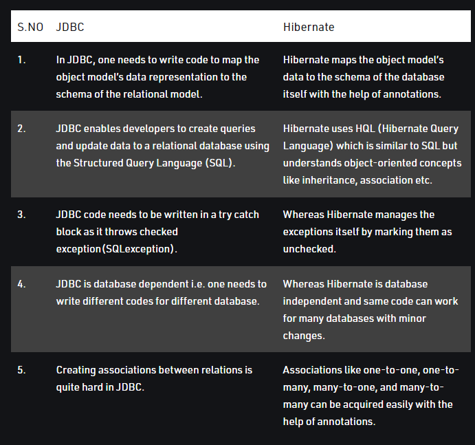

<h1> :books: Spring Core Notes :books: </h1>

<br>

# :snowflake: Spring Dependency Injection :snowflake:

-   Dependency injection in Spring can be done through `constructors`, `setters` or `fields`.

<br>

`CONSTRUCTOR BASED DEPEDENCY INJECTION`

```
public class Driver {

    private License license;

    // used to need @Autowired
    public Driver(License license) {
        this.license = license;
    }
}

```

<br>

`SETTER BASED DEPENDENCY INJECTION`

```
public class Driver {

    private License license;

    public void setLicense(License license) {
        thislicense = license;
    }
}

```

<br>

### Differences between the different types

-   Constructor Injection does not allow you to construct object, until your dependencies are ready.
-   Drawback of Setter Injection is security.
-   You can override certain dependency which is not possible with constructor injection as every time you call the constructor, a new object is created
-   Use setter injection when a number of dependencies are more or you need more readability
-   Use Constructor Injection when Object must be created with all of its dependencies.

<br>

### Inversion of Control

-   A principle in SWE which transfers the control of objects or portions of a program to a container or framework, often used in context of OOP.
-   IoC also known as Dependency Injection is a process whereby objects define their dependencies, that is, the other objects they work with,
    -   only through constructor arguments,
    -   arguments to a factory method, or properties that are set on the object instance after it is constructed
    -   or returned from a factory method

<br>
<br>

# :snowflake: Spring ApplicationContext (Spring IoC Container) :snowflake:

-   Represents the IoC (Inversion of Control) container
-   Spring container is responsible for instantiating, configuring and assembling objects known as beans as well as managing their lifecycle
-   Is where Spring holds instances of objects that it has identified to be managed and distributed automatically.
-   Primary job is to manage the spring beans
-   The interfaces `BeanFactory` and `ApplicationContext` represents the Spring IoC container.

<br>
<br>

# :snowflake: @SpringBootApplication :snowflake:

-   This single annotation is equivalent to using @Configuration, @EnableAutoConfiguration, @ComponentScan

<br>
<br>

# :snowflake: @Configuration :snowflake:

-   The @Configuration annotation indicates that the class has @Bean definition methods. So Spring container can process the class and generate Spring Beans to be used in the application.

Example use case

```
@Configuration
public class MyConfiguration {

    @Bean
    public MyBean myBean() {
		return new MyBean();
	}

}

-------

public class MySpringApp {

	public static void main(String[] args) {
		AnnotationConfigApplicationContext ctx = new AnnotationConfigApplicationContext();
		ctx.register(MyConfiguration.class);
		ctx.refresh();

		MyBean mb1 = ctx.getBean(MyBean.class);
		MyBean mb2 = ctx.getBean(MyBean.class);

		ctx.close();
	}

}

```

<br>

```
@Configuration
public class AppConfig {

    @Bean
    public Item item1() {
        return new ItemImpl1();
    }

    @Bean
    public Store store() {
        return new Store(item1());
    }
}

```

<br>
<br>

# :snowflake: @Bean :snowflake:

### What is a Bean?

-   In Spring, the objects that form the backbone of your application and that are managed by the Spring IoC container are the beans
-   Spring handles the lifecycle of the Bean
-   A bean is an object that is instantiated, assembled and otherwise managed by Spring IoC Contaner
-   For a bean with the default singleton scope, Spring first checks if a cached instance of the bean already exists, and only creates a new one if it doesn't.

<br>

### How does a bean gets converted to JSON?

-   @ResponseBody + JacksonHttpMessageConverters

<br>
<br>

# :snowflake: @Autowired :snowflake:

-   Allows Spring to resolve and inject collaborating beans into our bean.
-   The annotation is used for automatic dependency injection

<br>
<br>

# :snowflake: @Component :snowflake:

-   An annotation that allows Spring to automatically detect our custom beans
-   Spring will Scan our application for classes annotated with @Component, insantiate them and inject any specified dependencies into them
-   Specialised stereotype annotations are like @RestController, @Service etc.
-   Class-level annotation

<br>
<br>

# :snowflake: @ConfigurationProperties :snowflake:

-   allows to map entire Properties and Yaml files into an object easily
-   By default, the annotation reads from the `application.properties` file.

<br>

Example

```
app.color=steelblue
app.lang=en


@ConfigurationProperties(prefix="app")
public class AppProperties {

    private String color;
    private String lang;

    ... getters, setters

}

```

<br>
<br>

# :snowflake: JPA (Java Persistence API) :snowflake:

-   Used to examine, control and persist data between Java objects and relational databases.
-   Considered as a link between a object-oriented model and a relational database system.

<br>

Key Features of JPA

-   JPA is only a specification, not an implementation.
-   A set of rules and guidelines to set interfaces for implementing object-relational mapping.
-   Needs few classes and interfaces
-   Supports simple, cleaner, and assimilated object-relational mapping
-   supports polymorphism and inheritance

<br>
<br>

# :snowflake: Hibernate (an ORM tool) :snowflake:

-   Main feature of hibernate is to map Java classes to database tables
-   Hibernate is an IMPLEMENTATION of JPA guidelines.
-   Helps in mapping Java data types to SQL data types

<br>
<br>

# :snowflake: Difference between JPA and JDBC :snowflake:

Overview



<br>

### JDBC

-   an API for the Java programming language that defines how a client can access a database
-   Programmers can use these standard interfaces and classes to write applications that connect with dbs, send SQL queries and process the result.

Pros

-   Simple SQL processing
-   Good performance with large data
-   useful in applications where full control of the execution is required.

Cons

-   Large programming overhead - No encapsulaion
-   Hard to implement MVC concept
-   Queries are DBMS specifics

<br>

### JPA

-   A Java standard for binding Java objects to records in a relational database.
-   One of the possible soluions for ORM, where developers can perform CRUD operations on Relational databases using Java Objects (POJO).
-   Example of implementations of JPA are Hibernate, MyBatis, OpenJPA etc.


Pros

-   Provides encapsulation
-   Integration with java beans validation for easier validations
-   provides database independence

Cons

-   Not good for batch transactions, consumes too much memory.
-   Not thread-safe

<br>
<br>
