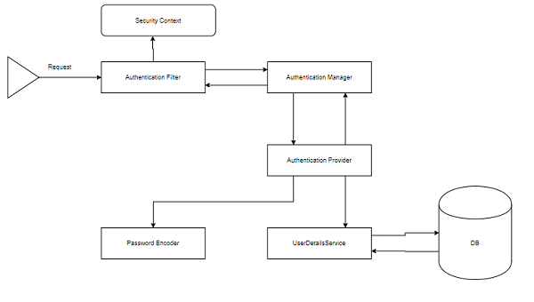
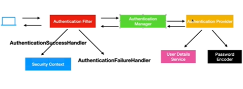
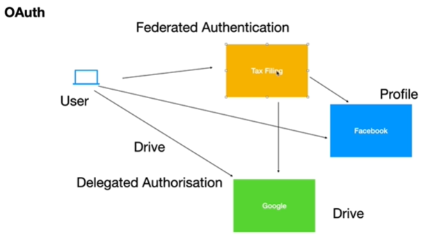
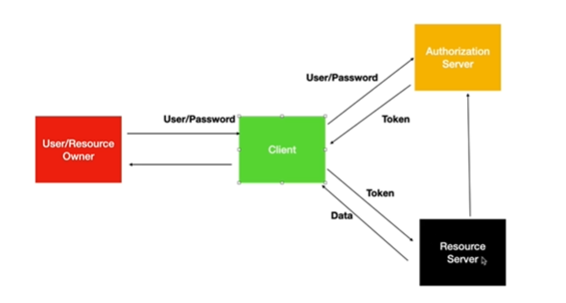
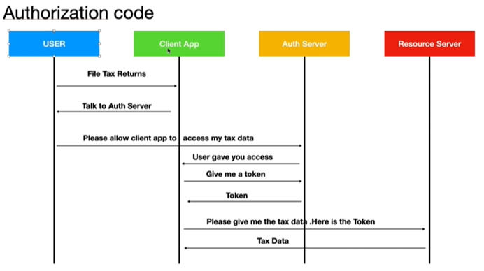
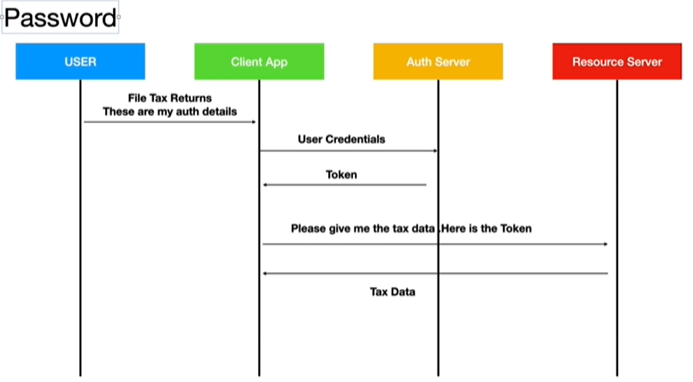
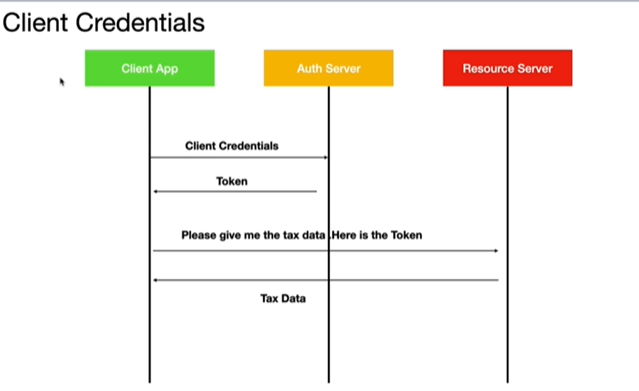

<h1> :books: Spring Core Notes :books: </h1>

# :snowflake: Key Security Components :snowflake:

The main components of Spring Security are



Authentication Filter (the only class)

-   The filter that intercepts requests and attempts to authenticate it. In
    Spring Security, it converts the request to an Authentication Object and
    delegrates the authentication to `AuthenticationManager`

Authentication Manager

-   Main Strategy Interface for authentication. Uses the lone method
    `authenticate()` to authenticate the reqeust
-   Returns an Authenticaion Object on successful authentication
-   Throws `AuthenticationException` in case of authentication failure.

Authentication Provider (can define our own authentication logic here)

-   Any class implementing the AuthenticationProvider interface must implement
    two methods, `authenticate()` and `supports()`
-   `support()` used to check if particular authentication type is supported
    by our Authentication Provider implementation class. Returns boolean.
-   `authenticate()` method is where authentication occurs, here is where the
    class use the `loadUserByUsername()` method of the `UserDetailsService`
    implementation.

User Details Service

-   Core interfaces of Spring Security
-   The authentication of any request mostly depends on the implementation of
    the UserDetailsService interface.

Password Encoder

-   Spring Security 5 mandated the use of PasswordEncoder to store passwords.
    Encode the user's password using their many implementations.

Spring Security Context

-   This is where the details of currently authenticated user are stored on
    successful authentication.
-   Authentication object is available throughout the application for the session.

On Success

-   AuthenticationSuccessHandler
-   Security Context

On Failure

-   AuthenticationFailureHandler

<br>



<br>
<br>

# :snowflake: @EnableWebSecurity :snowflake:

-   To enable Spring Security's web security support and provide Spring MVC
    integration
-   Exposes two beans to set some specifics for the web security configuration
    1. `SecurityFilterChain`
    2. `UserDetailsService`

<br>

### Additional Notes from Docs about Spring Boot Auto Configuration

https://docs.spring.io/spring-security/reference/servlet/getting-started.html

Spring Boot automatically

-   Enables Spring Security's default configuration, which creates a servlet
    `Filter` as a bean named `springSecurityFilterChain`. This bean is
    responsible for all the security (protecting URLs, validation etc).
-   Creates `UserDetailsService` bean with username of `user` and randomly
    generated password to console

<br>
<br>

# :snowflake: Filters in Spring Web Applications :snowflake:

Spring Security's Servlet support is based on Servlet `Filter`

Picture below shows typical layering of the handlers for a single HTTP request.


more than one Filter can be used to:

-   Prevent downstream Filters or the Servlet from being invoked. In this instance
    the Filter will typically write the HttpServletResponse.

-   Modify the HttpServletRequest or HttpServletResponse used by the downstream
    Filters and Servlet

<br>

### `DelegatingFilterProxy`

-   A filter implementation that allows briding between Servlet container's
    lifecycle and Spring's `ApplicationContext`.
-   The Servlet Container allows registering of `Filter`s using its own
    standards but it is not aware of Spring defined Beans
-   `DelegatingFilterProxy` can be registered via standard Servlet container
    mechanisms, but delegates all the work to a Spring Bean that implements
    `Filter`

Example


<br>

```

public void doFilter(ServletRequest request, ServletResponse response, FilterChain chain) {
	// Lazily get Filter that was registered as a Spring Bean
	// For the example in DelegatingFilterProxy delegate is an instance of Bean Filter0
	Filter delegate = getFilterBean(someBeanName);
	// delegate work to the Spring Bean
	delegate.doFilter(request, response);
}

```

<br>

### `SecurityFilterChain` and `FilterChainProxy`

-   Allows delegation to many `Filter` instances through `SecurityFilterChain`.
-   It is a bean, thus it is typically wrapped in a `DelegatingFilterProxy`

-   `SecurityFilterChain` is used by `FilterChainProxy` to determine which
    Spring Security `Filter` should be invoked for the request


<br>

-   The Security Filters in `SecurityFilterChain` are typically Beans but are
    registered with `FilterChainProxy`
    -   Provides a starting point for all Spring Security Servlet support
    -   If attempting to troubleshoot, adding debug point in
        `FilterChainProxy` is a good place to start
    -   `FilterChainProxy` can be used to determine which
        `SecurityFilterChain` should be used, allowing a totally separate
        configuration for different slices of your application.


<br>
<br>

# :snowflake: Servlet Authentication Architecture :snowflake:

### Security Context Holder


-   `SecurityContextHolder` is where Spring Security stores the details of
    who is authenticated.
-   Spring Security does not care how the `SecurityContextHolder` is populated,
    if there is a value, then it is used as the currently authenticated user.

Example: Simplest way to indicate a user is authenticated is to set the
`SecurityContextHolder` directly.

```
SecurityContext context = SecurityContextHolder.createEmptyContext();
Authentication authentication = new TestingAuthenticationToken("username", "password", "ROLE_USER");
context.setAuthentication(authentication);
SecurityContextHolder.setContext(context);

```

Example: to retrieve current authenticated user

```
SecurityContext context = SecurityContextHolder.getContext();
Authentication authentication = context.getAuthentication();
String username = authentication.getName();
Object principal = authentication.getPrincipal();
Collection<? extends GrantedAuthority> authorities = authentication.getAuthorities();

```

<br>

### SecurityContext

-   The SecurityContext is obtained from the SecurityContextHolder. The SecurityContext contains an `Authentication` object.

<br>

### Authentication

-   Servers two main purposes within Spring Security

    -   an input to `AuthenticationManager` to provide the credentials a user has provided to authenticate.
    -   Represents the currently authenticated user. Current `Authentication` can be obtained from the `SecurityContext`.

-   contains the following:

    -   `principal` which identifies the user.
    -   `credentials` often a password
    -   `authorities` the GrantedAuthority are high level permissions the user is granted, examples are roles or scopes

<br>

### GrantedAuthority (interface)

-   Interface to get an authority to authorize/control an access.
-   Think of it as a "permission" which are expressed as strings

<br>

### AuthenticationManager

-   is the API that defines how Spring Security Filters perform authentication
-   The `Authentication` that is returned is then set on the `SecurityContextHolder` by the controller (i.e. spring security filters) that invoked the `AuthenticationManager`.

<br>

### ProviderManager (could be what you need for your current task at work/project)

-   ProviderManager delegates to a `List` of AuthenticationProviders. Each AuthenticationProvider has an opportunity to indicate that authentication should be successful, fail.


-   In practice each AuthenticationProvider knows how to perform a specific type of authentication. For example, one AuthenticationProvider might be able to validate a username/password, while another might be able to authenticate a SAML assertion.
-   This allows each AuthenticationProvider to do a very specific type of authentication, while supporting multiple types of authentication and only exposing a single AuthenticationManager bean.

<br>
<br>

# :snowflake: `antMatchers` vs `mvcMatchers` :snowflake:

-   antMatcher("/users/\*\*") matches any path starting with /users
-   antMatchers("/users") matches only the exact /users URL
-   mvcMatchers("/users") matches /users, /users/, /users.html
-   mvcMatchers is more new and more secure (needs more research why)

<br>
<br>

# :snowflake: OAuth :snowflake:

-   Allows one application to get access to another application user's data
    without user sharing its userId and password
-   Federated Authentication, Delegated Authorisation



<br>

Overview of OAuth Key Components

-   Client
-   Authorization Server
-   Resource Server



<br>

### Grant Types

-   Authorization Code (login using google, github etc are some examples)



-   Password



-   Client Credentials (microservices, apps talking to other apps)



-   Refresh Token (Has to be used with the 3 above, complements the 3 above)

<br>
<br>

# :snowflake: Additional Notes :snowflake:

-   To implement custom authentication logic, the parameters we pass to
    authenticate the method of AuthenticationManager is
    `UsernamePasswordAuthenticationToken`

<br>
<br>
